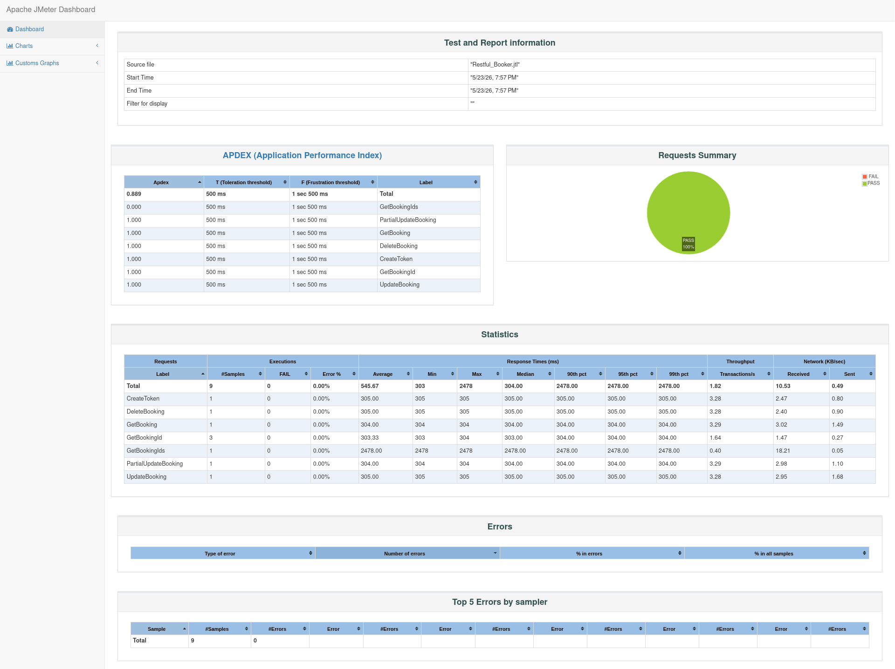

# 🚀 Restful Booker API Performance Testing Using JMeter

<div align="center">


### End-to-End API Performance Testing Project for Restful Booker using Apache JMeter

**Performance Testing | API Validation | JMeter Dashboard Analysis | Software Quality Assurance**

</div>

---

# 📖 Project Overview

This project demonstrates comprehensive API Performance Testing of the **Restful Booker** application using **Apache JMeter**. The primary objective was to evaluate API responsiveness, reliability, stability, and overall system behavior while executing multiple booking-related operations.

The test suite covers the complete booking lifecycle including authentication, booking retrieval, booking update, partial update, and booking deletion. Performance metrics were collected and analyzed using the JMeter HTML Dashboard Report to assess application behavior during execution.

This project reflects practical Software Quality Assurance (SQA) activities involving API verification, response validation, performance measurement, and result analysis.

---

# 🎯 Testing Objectives

The objectives of this performance testing project were:

- Verify API functionality during execution
- Measure API response times
- Evaluate request success and failure rates
- Analyze application responsiveness
- Validate authentication mechanisms
- Generate performance reports and dashboard analytics
- Gain practical experience in API Performance Testing using Apache JMeter
- Understand performance metrics interpretation and reporting

---

# 🌐 Application Under Test

| Item | Details |
|--------|---------|
| Application Name | Restful Booker |
| Application Type | RESTful Booking Management API |
| Testing Type | API Performance Testing |
| Protocol | HTTPS |
| Authentication | Token-Based Authentication |

### Base URL

```http
https://restful-booker.herokuapp.com
```

Restful Booker is a publicly available REST API frequently used by QA Engineers, Automation Testers, and Performance Engineers for testing practice and learning purposes.

---

# 🛠️ Technology Stack

| Category | Technology |
|-----------|------------|
| Performance Testing Tool | Apache JMeter |
| API Type | REST API |
| Authentication | Token Authentication |
| Test Script Format | JMX |
| Result File Format | JTL |
| Reporting Engine | JMeter HTML Dashboard |
| Runtime Environment | Java |
| Operating System | Kali Linux |
| Version Control | Git |
| Repository Hosting | GitHub |

---

# 📋 Test Scenarios Covered

The following API endpoints were tested during execution:

| Scenario | HTTP Method | Purpose |
|------------|-------------|----------|
| Get Booking IDs | GET | Retrieve available booking IDs |
| Get Booking | GET | Retrieve booking information |
| Get Booking Details | GET | Validate booking retrieval |
| Create Authentication Token | POST | Generate authentication token |
| Update Booking | PUT | Update booking information |
| Partial Update Booking | PATCH | Modify selected booking fields |
| Delete Booking | DELETE | Remove booking information |

---

# 🔄 End-to-End Test Workflow

```text
Get Booking IDs
       │
       ▼
Get Booking Information
       │
       ▼
Create Authentication Token
       │
       ▼
Update Booking
       │
       ▼
Partial Update Booking
       │
       ▼
Delete Booking
```

The workflow simulates a complete booking management lifecycle and validates API functionality across multiple operations.

---

# ⚙️ JMeter Components Used

## Thread Group

Used for configuring:

- Virtual Users
- Ramp-Up Time
- Loop Count
- Execution Control

---

## HTTP Request Sampler

Used to perform API requests against target endpoints.

Supported methods:

- GET
- POST
- PUT
- PATCH
- DELETE

---

## HTTP Header Manager

Configured request headers:

```http
Content-Type: application/json
Accept: application/json
Cookie: token={generated_token}
```

---

## JSON Extractor

Used for dynamic parameterization:

- Authentication Token Extraction
- Booking ID Extraction
- Runtime Data Handling

---

## Response Assertions

Implemented validations for:

- Expected HTTP Status Codes
- API Response Verification
- Success Criteria Validation

---

## View Results Tree

Used for:

- Request Inspection
- Response Validation
- Debugging
- Test Result Verification

---

# 📊 Performance Test Execution Summary

## Execution Statistics

| Metric | Result |
|----------|----------|
| Total Requests Executed | 9 |
| Successful Requests | 9 |
| Failed Requests | 0 |
| Success Rate | 100% |
| Error Rate | 0% |

---

## Test Outcome

### ✅ Successful Execution

All API requests executed successfully.

### ✅ No Request Failures

No failed transactions were detected during execution.

### ✅ Functional Validation Passed

All API endpoints returned expected responses.

### ✅ Authentication Validation Passed

Token generation and authorization workflow operated correctly.

---

# ⏱️ Response Time Analysis

| Metric | Value |
|----------|----------|
| Average Response Time | 545.67 ms |
| Minimum Response Time | 303 ms |
| Maximum Response Time | 2478 ms |

### Performance Observations

- Most API requests completed within approximately 300 milliseconds.
- Response times remained consistent across operations.
- No timeout issues were observed.
- Application successfully processed all requests.
- API responses remained stable throughout execution.
- Booking retrieval endpoint recorded the highest response time due to larger response payload processing.

---

# 📈 APDEX Analysis

APDEX (Application Performance Index) is an industry-standard metric used to measure user satisfaction based on application response times.

### Dashboard Result

| Metric | Score |
|----------|----------|
| APDEX Score | 0.889 |

### Interpretation

| Score Range | User Satisfaction |
|-------------|------------------|
| 0.94 – 1.00 | Excellent |
| 0.85 – 0.93 | Good |
| 0.70 – 0.84 | Fair |
| Below 0.70 | Poor |

### Result

**APDEX Score: 0.889**

This indicates that the application delivered a **Good User Experience** under the executed test conditions.

---

# 📊 Dashboard Overview

The Apache JMeter HTML Dashboard provides a visual representation of execution metrics and performance insights.

## Dashboard Screenshot



---

## Metrics Evaluated

### APDEX Analysis

Measures user satisfaction based on response times.

### Request Summary

Displays:

- Success Rate
- Failure Rate
- Request Distribution

### Statistics Report

Provides:

- Average Response Time
- Median Response Time
- Percentiles
- Throughput
- Error Percentage

### Response Time Analysis

Measures:

- Fastest Request
- Slowest Request
- Average Processing Time

### Error Analysis

Tracks:

- Failed Requests
- Assertion Failures
- HTTP Errors

### Throughput Monitoring

Measures:

- Requests Per Second
- System Processing Capacity

---

# 📂 Repository Structure

```text
Restful-Booker-Performance-Testing/
│
├── README.md
│
├── Dashboard_Report/
│   ├── index.html
│   ├── content/
│   └── sbadmin2-1.0.7/
│
├── Screenshots/
│   ├── dashboard-overview.png
│   ├── statistics.png
│   ├── response-times.png
│   └── throughput.png
│
├── JMX_File/
│   └── Restful_Booker.jmx
│
├── Test_Results/
│   └── Restful_Booker.jtl
│
└── Documentation/
    └── Performance_Test_Report.pdf
```

---

# 🌍 Live Dashboard

The complete JMeter HTML Dashboard can be accessed through GitHub Pages.

### View Dashboard

```text
https://your-github-username.github.io/Restful-Booker-Performance-Testing/Dashboard_Report/
```

Replace the URL with your actual GitHub Pages link after deployment.

---

# ▶️ How to Execute the Test

## Clone Repository

```bash
git clone https://github.com/mostafizur-zahid/Restful-Booker-Performance-Testing.git
```

---

## Launch Apache JMeter

```bash
jmeter
```

---

## Open Test Plan

```text
File → Open → Restful_Booker.jmx
```

---

## Run Test

```text
Run → Start
```

---

## Generate Dashboard Report

```bash
jmeter -g Restful_Booker.jtl -o Dashboard_Report
```

---

# 🔍 Key Findings

### Positive Outcomes

- 100% request execution success rate
- Zero request failures
- Successful authentication workflow
- Consistent response behavior
- Stable API performance
- Complete CRUD workflow validation
- Accurate response assertions
- Successful dynamic data extraction

---

# 💡 Software Quality Assurance Perspective

From an SQA standpoint, this project demonstrates:

### Requirement Validation

Ensuring API endpoints behave according to expected requirements.

### Functional Verification

Verifying correctness of CRUD operations.

### Performance Evaluation

Measuring system responsiveness and stability.

### Quality Assurance Reporting

Analyzing execution metrics and presenting performance findings.

### Risk Identification

Detecting potential performance bottlenecks and slow-performing endpoints.

### Continuous Quality Monitoring

Providing measurable indicators for future performance comparison.

---

# 📚 Learning Outcomes

This project enhanced practical knowledge in:

- Apache JMeter
- API Performance Testing
- REST API Validation
- Token-Based Authentication
- JSON Extraction
- Response Assertions
- JTL Result Analysis
- Dashboard Reporting
- Performance Metrics Interpretation
- Software Quality Assurance Practices
- Test Planning and Execution
- Performance Analysis and Reporting

---

# 🚀 Future Enhancements

Planned improvements include:

- Load Testing with Multiple Users
- Stress Testing
- Spike Testing
- Endurance Testing
- Scalability Testing
- Distributed Load Testing
- Jenkins CI/CD Integration
- Automated Performance Regression Testing
- Performance Baseline Comparison
- Real-Time Monitoring Integration

---

# 👨‍💻 Author

## Mostafizur Rahman Zahid

**Aspiring Security Engineer | Software Quality Assurance Enthusiast | DevSecOps Learner | NLP Researcher**

### Connect With Me

**GitHub**

https://github.com/mostafizur-zahid

**LinkedIn**

https://www.linkedin.com/in/mostafizur-zahid

---

# ⭐ Support

If you found this project useful or insightful, consider giving the repository a **Star ⭐**. Your support encourages continuous learning, knowledge sharing, and future contributions in Software Quality Assurance and Performance Engineering.

---

<div align="center">

### Thank You for Visiting This Project

**Performance Testing • Quality Engineering • Continuous Improvement**

</div>
